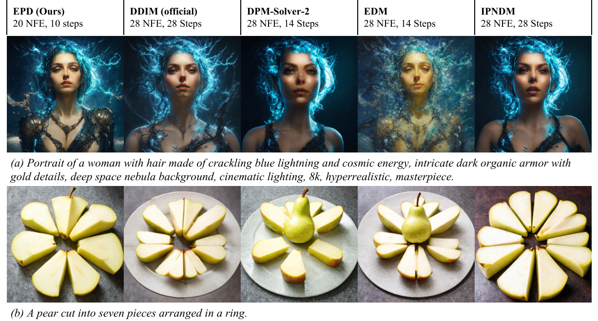
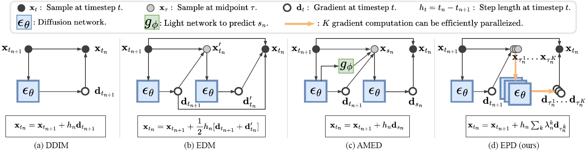
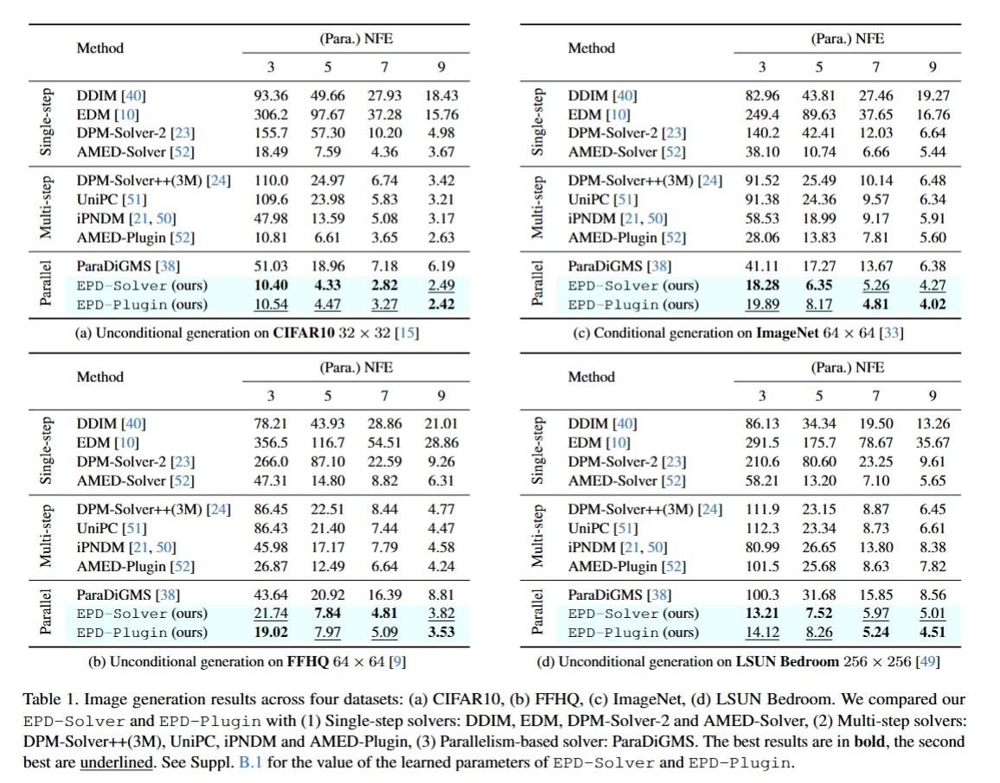
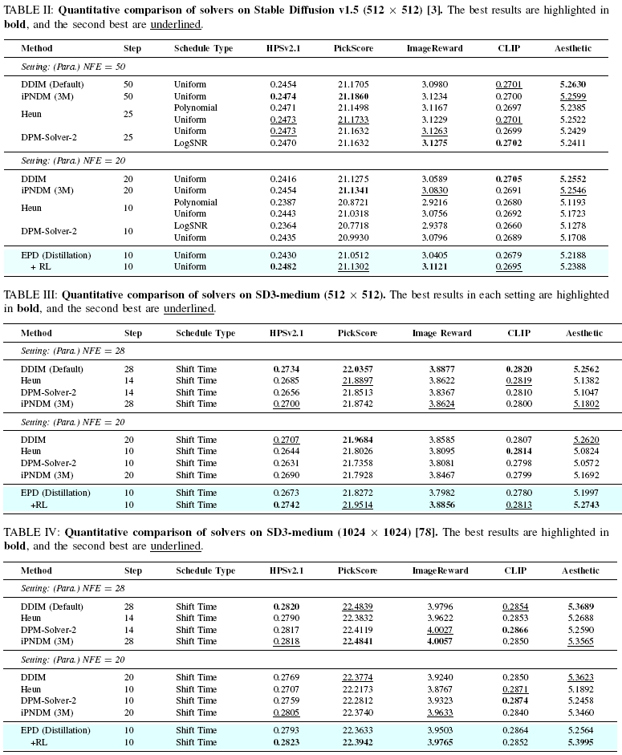

# Parallel Diffusion Sampling with Low-Dimensional Alignment <br><sub>Official implementation</sub>

<div align="center">

</div>

**Abstract**: Diffusion models (DMs) reach state-of-the-art generative quality but still incur high sampling latency because denoising is sequential. Solver-based acceleration often degrades image quality under tight latency budgets, mainly from accumulated **truncation errors** when high-curvature trajectory segments are missed. We propose the **Ensemble Parallel Direction solver** (EPD), an ODE solver that reduces these errors by evaluating multiple gradients in parallel at each step. Guided by the observation that sampling trajectories lie near a low-dimensional manifold, EPD leverages the Mean Value Theorem for vector-valued functions to better approximate the integral solution. The extra gradients are independent and **fully parallelizable**, so low-latency sampling is preserved without extra inference cost. We adopt a **two-stage optimization framework**: first distill a small set of learnable parameters to keep training overhead minimal, then apply a parameter-efficient **Reinforcement Learning (RL) fine-tuning** scheme that treats the solver as a stochastic Dirichlet policy. Unlike backbone fine-tuning, this RL stage stays within the **low-dimensional solver space**, mitigating reward hacking while improving text-to-image performance. The method is flexible and can also serve as a plugin (**EPD-Plugin**) to upgrade existing ODE samplers. On validation benchmarks at the same 5 NFE latency, the distilled EPD achieves state-of-the-art FIDs of 4.47 on CIFAR-10, 7.97 on FFHQ, 8.17 on ImageNet, and 8.26 on LSUN Bedroom, surpassing existing learning-based solvers. On text-to-image benchmarks, RL-tuned EPD boosts human preference scores on both Stable Diffusion v1.5 and SD3-medium, and even beats the official 28-step SD3-Medium baseline with only 20 steps, reconciling efficiency and fidelity.

<div align="center">

</div>

<div align="center">

</div>

## Requirements

*Acknowledgement: This codebase builds on [EDM](https://github.com/NVlabs/edm) as the base environment.*

To configure your environment, run:

```bash
conda env create -f environment.yml -n epd
conda activate epd
pip install omegaconf gdown
conda install lightning -c conda-forge -y
pip install git+https://github.com/openai/CLIP.git
pip install transformers
pip install taming-transformers
pip install -e git+https://github.com/CompVis/taming-transformers.git@master#egg=taming-transformers
pip install kornia fairscale piq accelerator timm einops
pip install HPSv2
pip install --upgrade diffusers[torch]
```

Use the commands below to download the required model weights.
- [SD1.5 model weights](https://huggingface.co/dnwalkup/StableDiffusion-v1-Releases/resolve/main/v1-5-pruned-emaonly.ckpt)
- [HPSv2.1](https://huggingface.co/xswu/HPSv2/blob/main/HPS_v2.1_compressed.pt)
- [Aesthetic](https://huggingface.co/haor/aesthetics/resolve/main/sac%2Blogos%2Bava1-l14-linearMSE.pth)
- [MPS](https://drive.usercontent.google.com/download?id=17qrK_aJkVNM75ZEvMEePpLj6L867MLkN&export=download&authuser=0&confirm=t&uuid=56d957a5-dcbb-4bd4-8c99-c53056009c7f&at=ALWLOp6W0qUwp5vV-v5nIwVY8L9U%3A1764524212974)
- [ImageReward](https://huggingface.co/THUDM/ImageReward/blob/main/ImageReward.pt)
- [PickScore](https://github.com/yuvalkirstain/pickscore)

```bash
cd src/ms_coco
wget https://huggingface.co/dnwalkup/StableDiffusion-v1-Releases/resolve/main/v1-5-pruned-emaonly.ckpt
cd ..
cd ..
python download_hpsv2_weights.py --version v2.1
cd weights
wget https://huggingface.co/haor/aesthetics/resolve/main/sac%2Blogos%2Bava1-l14-linearMSE.pth
gdown 17qrK_aJkVNM75ZEvMEePpLj6L867MLkN
cd ..
./download.sh  # ignore any output generated by this script
```

*Note*: SD3-Medium model weights download automatically the first time the relevant code runs.

## Implementation Guide

Always point to the local HPS and taming-transformers packages whenever related code runs:

```bash
export PYTHONPATH="$PWD/HPSv2:$PWD/src/taming-transformers:$PYTHONPATH"
```

See [launch.sh](./launch.sh) for RL training, sampling, and evaluation commands.

We also provide a detailed guide for each part below.

### RL Training

Train EPD-Solver with the recommended configs: [sd3_512.yaml](./training/ppo/cfgs/sd3_512.yaml), [sd3_1024.yaml](./training/ppo/cfgs/sd3_1024.yaml), [sd15.yaml](./training/ppo/cfgs/sd15.yaml). Parameter details are in the next section.

For convenience, we provide distilled EPD predictor checkpoints as RL starting points: [sd3-512-distilled.pkl](./exps/sd3-512/sd3-512-distilled.pkl), [sd3-1024-distilled.pkl](./exps/sd3-1024/sd3-1024-distilled.pkl), [sd15-distilled.pkl](./exps/sd15/sd15-distilled.pkl).

Launch training with:

```bash
torchrun --master_port=12345 --nproc_per_node=1 -m training.ppo.launch \
    --config training/ppo/cfgs/[sd15.yaml, sd3_512.yaml, sd3_1024.yaml]
```

### Inference

We also provide our best model checkpoints (see released artifacts).

To generate images with an EPD-Solver, use the examples below (replace checkpoint paths with your own exports as needed):

```bash
## SD1.5
MASTER_PORT=12345 python sample.py \
    --predictor_path exps/sd15/sd15-best.pkl \
    --prompt-file src/prompts/test.txt \
    --seeds "0-19" \
    --batch 4 \
    --outdir samples/sd15

## SD3-Medium
python sample_sd3.py --predictor exps/sd3-1024/sd3-1024-best.pkl \
  --seeds "0" \
  --outdir samples/sd3 \
  --prompt "..."
```

### Evaluation

We provide six metrics to evaluate generated images: HPSv2.1, PickScore, ImageReward, CLIP, Aesthetic, and MPS. The evaluation script lives at the bottom of [launch.sh](./launch.sh).

## Parameter Description

**Sampling (`sample.py`)**

| Parameter | Default | What it controls |
|-----------|---------|------------------|
| `predictor_path` | required | EPD predictor snapshot (.pkl); numeric IDs auto-resolve to the latest matching checkpoint in `./exps`. |
| `model_path` | None | (Reserved) optional backbone checkpoint override; currently unused because backbones auto-resolve from dataset tags. |
| `max_batch_size` (`--batch`) | `64` | Per-process batch size; seeds are split across ranks. |
| `seeds` | `0-63` | Seed list or range; determines how many images are generated. |
| `prompt` | None | Single text prompt for all seeds; if omitted, falls back to `prompt-file` or MS-COCO eval captions for `dataset_name=ms_coco`. |
| `prompt-file` | None | Text or CSV (column `text`) with prompts; used when `prompt` is empty. |
| `backend` | Predictor metadata | Override backbone (`ldm`/`sd3`); defaults to what is stored in the predictor. |
| `backend-config` | None | JSON object overriding backend options (e.g., SD3 resolution/torch_dtype/offload/token). |
| `use_fp16` | `False` | Reserved flag for mixed precision (not currently wired). |
| `return_inters` | `False` | Reserved flag for saving intermediates (not currently wired). |
| `outdir` | Auto (`./samples/{dataset}` or `./samples/grids/{dataset}`) | Output root; falls back to a derived path when unset. |
| `grid` | `False` | Save a grid per batch instead of per-image files. |
| `subdirs` | `True` | When saving per-image files, create 1k-chunked subfolders. |

**Sampling (`sample_sd3.py`)**

| Parameter | Default | What it controls |
|-----------|---------|------------------|
| `predictor` | required | SD3 EPD predictor snapshot (.pkl). |
| `seeds` | `0-3` | Seed list or range; determines how many images are generated. |
| `prompt` | None | Single prompt for all seeds; if empty, uses `prompt-file` or falls back to empty prompts. |
| `prompt-file` | None | Text/CSV file with prompts; repeats to match `seeds` length. |
| `outdir` | `./samples/sd3_epd` | Output directory. |
| `grid` | `False` | Save a grid per batch. |
| `max-batch-size` | `4` | Per-batch sample count (`--max-batch-size`). |
| `resolution` | Predictor/back-end config (512 or 1024) | Optional override; must match predictor metadata if set. |

**Solver metadata (read from predictor checkpoints)**

| Parameter | Default source | Notes |
|-----------|----------------|-------|
| `dataset_name` | Predictor ckpt | Dataset tag (e.g., `ms_coco`); drives prompt fallback and output paths. |
| `backend` / `backend_config` | Predictor ckpt | Backbone type plus stored options (resolution, flow-match params, offload/token settings for SD3, etc.). |
| `num_steps` | Predictor ckpt | Inference steps; base NFE `2*(num_steps-1)` (minus one eval when `afs=True`, doubled again for CFG in ms_coco). |
| `num_points` | Predictor ckpt | Number of intermediate points per step; used for NFE reporting/outdir naming. |
| `guidance_type` / `guidance_rate` | Predictor ckpt | CFG sampling (e.g., 4.5 for SD3 PPO configs, 7.5 for SD1.5). |
| `schedule_type` / `schedule_rho` | Predictor ckpt | `flowmatch` for SD3, `discrete` for SD1.5. |
| `sigma_min` / `sigma_max` | Predictor or backend | Noise range passed to scheduler (falls back to backend defaults when unset). |
| `flowmatch_mu` / `flowmatch_shift` | Predictor or backend | Flow-matching parameters used by SD3 schedules. |
| `afs`, `max_order`, `predict_x0`, `lower_order_final` | Predictor ckpt | EPD/DPM solver behavior flags. |

**RL Training configs (`training/ppo/cfgs/*.yaml`)**

| Key | sd3_512 | sd3_1024 | sd15 | Purpose |
|-----|---------|----------|------|---------|
| `data.predictor_snapshot` | `exps/sd3-512/...-distilled.pkl` | `exps/sd3-1024/...-distilled.pkl` | `exps/sd15/...-distilled.pkl` | Starting EPD predictor. |
| `model.backend` | `sd3` | `sd3` | `ldm` | Backbone family used during RL. |
| `model.resolution` | `512` | `1024` | n/a | SD3 training resolution (LDM inherits from predictor/backbone). |
| `model.schedule_type` | `flowmatch` | `flowmatch` | `discrete` | Diffusion schedule during RL. |
| `model.guidance_rate` | `4.5` | `4.5` | `7.5` | CFG scale used while training the solver. |
| `ppo.rollout_batch_size` | `16` | `8` | `8` | Samples per PPO rollout. |
| `ppo.dirichlet_concentration` | `10` | `10` | `20` | Dirichlet policy concentration. |
| `reward.batch_size` | `4` | `4` | `4` | Reward evaluation batch size. |
| `reward.multi.weights` | `hps:1.0` (others 0) | same | same | Per-head reward weights. |

Shared defaults across configs: `model.dataset_name=ms_coco`, `model.guidance_type=cfg`, `model.schedule_rho=1.0`, `model.num_steps/num_points/sigma_min/sigma_max` left `null` to inherit predictors/backends, `reward.type=multi`, `reward.enable_amp=true`, `reward.weights_path=weights/HPS_v2.1_compressed.pt`, `ppo.learning_rate=7e-5`, `ppo.minibatch_size=4`, `ppo.ppo_epochs=1`, `ppo.rloo_k=4`, `ppo.clip_range=0.2`, `ppo.kl_coef=0.0`, `ppo.entropy_coef=0.0`, `ppo.max_grad_norm=1.0`, `ppo.decode_rgb=true`, `ppo.steps=99999`, `logging.log_interval=1`, `logging.save_interval=500`, `run.output_root=exps`, `run.seed=0`.

## 🚀 Performance Highlights
<div align="center">

</div>

<div align="center">

</div>

## Citation
If you find this repository useful, please consider citing the following paper:

```

```
